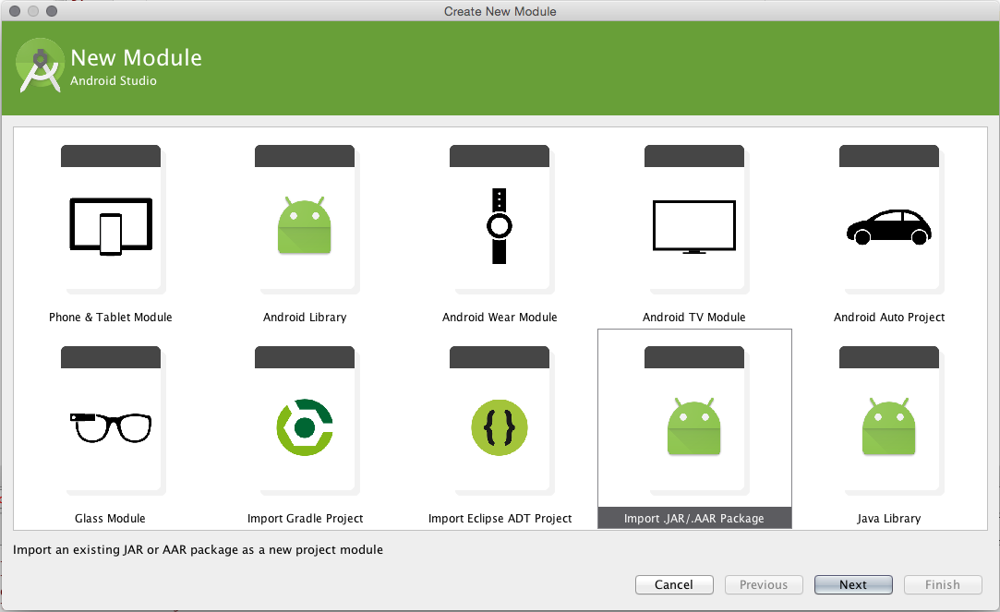
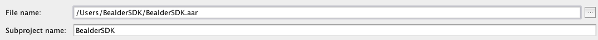
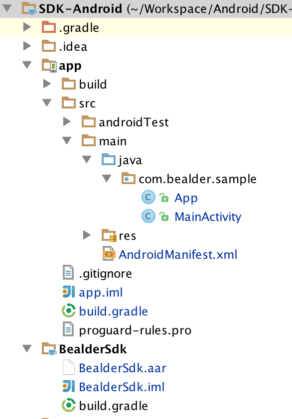

# BealderSDK 2.3

## Preparation

 * Get your **APP_ID** and **APP_KEY** from [app.bealder.com](https://app.bealder.com)

## Import SDK

In Android Studio :

 * File > New > New module... > Import .Jar or .Aar package

 

 * You can change the name of Bealder SDK :

 

 * Finally if you have imported correctly :

 

 * **Note**: The module should already be added in `settings.gradle` by Android Studio during the import process.

 ```
 include ':app', ':BealderSdk'
 ```

 * The `build.gradle` settings app :

```
dependencies {
    ....
    compile 'com.android.support:appcompat-v7:23.3.0'
    compile 'com.mcxiaoke.volley:library:1.0.15'
    compile 'com.android.support:support-v4:23.3.0'
    compile 'com.google.android.gms:play-services-location:7.8.0'
    compile 'org.altbeacon:android-beacon-library:2.7'
    compile project(':BealderSdk')
}
```

## Add the following elements to your __`manifest.xml`__

####	Permissions

```XML
    <uses-permission android:name="android.permission.BLUETOOTH" />
    <uses-permission android:name="android.permission.BLUETOOTH_ADMIN" />
    <uses-permission android:name="android.permission.INTERNET" />
    <uses-permission android:name="android.permission.ACCESS_NETWORK_STATE" />
    <uses-permission android:name="android.permission.VIBRATE" />
    <uses-permission android:name="android.permission.RECEIVE_BOOT_COMPLETED" />
    <uses-permission android:name="android.permission.ACCESS_FINE_LOCATION" />
    <uses-permission android:name="android.permission.ACCESS_COARSE_LOCATION" />
    <uses-permission android:name="android.permission.CHANGE_WIFI_STATE" />
    <uses-permission android:name="android.permission.ACCESS_WIFI_STATE" />
```

####	Under application

```XML
<!-- API_KEY Bealder -->
<meta-data
    android:name="com.bealder.sdk.API_ID"
    android:value="APP_ID" />
<meta-data
    android:name="com.bealder.sdk.API_KEY"
    android:value="APP_KEY" />
    
<activity android:name="com.bealder.sdk.AdvertActivity"></activity>

<receiver
    android:name="com.bealder.sdk.GeofenceReceiver"
    android:exported="false">
    <intent-filter>
        <action android:name="com.bealder.sdk.ACTION_RECEIVE_GEOFENCE" />
    </intent-filter>
</receiver>

<receiver android:name="com.bealder.sdk.BootReceiver">
    <intent-filter>
        <action android:name="android.intent.action.BOOT_COMPLETED" />
    </intent-filter>
</receiver>

```

####	Class Application

 * Create class application if it doesn't exist and add declaration to your `manifest.xml`:

```XML
	<application
        android:name=".ApplicationClass"
```

## Class Application, you need :

 * To implement BootstrapNotifier
 * Set BealderSDK

```Java
import android.app.Application;
import android.graphics.Color;
import com.bealder.sdk.manager.BealderParameters;
import com.bealder.sdk.manager.BealderSDK;
import org.altbeacon.beacon.Region;
import org.altbeacon.beacon.startup.BootstrapNotifier;
import org.altbeacon.beacon.startup.RegionBootstrap;

public class ApplicationClass extends Application implements BootstrapNotifier {

    private RegionBootstrap regionBootstrap;
    private BealderSDK bealderSDK;

    @Override
    public void onCreate() {
        super.onCreate();

        // Initialise Bealder - require -
        bealderSDK = new BealderSDK(this);

        // Show debug in logcat
        //BealderParameters.setDebugMod();

        // Set Icon - require -
        // It will set an icon for the push notification
        BealderParameters.setNotifIcon(R.drawable.ic_launcher);
        BealderParameters.setNotifIconL(R.drawable.icon_notif_l);
        BealderParameters.setNotifColorL(Color.parseColor("#357f77"));

        // If Token Push, send it, any time
        //BealderParameters.setTokenPush(TOKEN_PUSH);

        // Set region to bootstrap - require -
        regionBootstrap = new RegionBootstrap(this, bealderSDK.getRegion());

        // - require -
        bealderSDK.run(this);

    }

    @Override
    public void didEnterRegion(Region region) {
        bealderSDK.enterRegion(region);
    }

    @Override
    public void didExitRegion(Region region) {
        bealderSDK.exitRegion(region);
    }

    @Override
    public void didDetermineStateForRegion(int state, Region region) {
        // Do nothing
    }
}
```

##   Principal Activity

 >	You can start to use the app but if you need more informations some methods need to be overridden:

```Java
import com.bealder.sdk.manager.BealderParameters;

public class FirstActivity extends Activity {

    private int LOCATION_REQUEST_CODE = 0;

    @Override
    protected void onCreate(Bundle savedInstanceState) {
        super.onCreate(savedInstanceState);
        setContentView(com.bealder.R.layout.activity_first);
	
        // You need to request the Location Permissions if the Android Version is M or above	
        if (!canAccessLocation())
            ActivityCompat.requestPermissions(this, new String[]{Manifest.permission.ACCESS_FINE_LOCATION}, LOCATION_REQUEST_CODE);

        // If you want to ask BLE activation
        BealderParameters.askBleActivation(this);
        // If you want to ask localisation activation
        BealderParameters.askGPSActivation(this);

    }

    @Override
    protected void onStart() {
        super.onStart();
        // - require -
        BealderParameters.onStart();
    }

    @Override
    protected void onStop() {
        super.onStop();
        // - require -
        BealderParameters.onStop();
    }
    
    private boolean canAccessLocation() {
        if (Build.VERSION.SDK_INT >= Build.VERSION_CODES.M)
            return(PackageManager.PERMISSION_GRANTED == ContextCompat.checkSelfPermission(this, Manifest.permission.ACCESS_FINE_LOCATION));
        else
            return true;
    }
    
```
