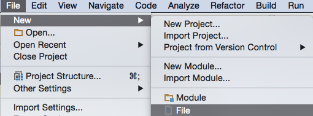

# BealderSDK 2.1

## Preparation

 * Get your **APP_ID** and **APP_KEY** from [app.bealder.com](https://app.bealder.com)

## Import SDK

 * Aar file is used as a new module :

 

 * choise new module :

 

 * you can change the name of Bealder SDK :

 

 * Finaly if you have imported correctly :

 

 * **Note**: The module should already be added in `settings.gradle` by Android Studio during the import process.

 ```
 include ':app', ':BealderSdk'
 ```

 * The `build.gradle` settings app :

```
dependencies {
    ....
    compile 'com.google.android.gms:play-services-location:7.3.0'
    compile 'com.mcxiaoke.volley:library:1.0.15'
    compile 'com.android.support:support-v4:21.0.3'
    compile 'org.altbeacon:android-beacon-library:2.5.1'
    compile project(':BealderSdk')
}
```

## Add the following elements to your __`manifest.xml`__

####	Permissions

```XML
<uses-permission android:name="android.permission.BLUETOOTH" />
<uses-permission android:name="android.permission.BLUETOOTH_ADMIN" />
<uses-permission android:name="android.permission.INTERNET" />
<uses-permission android:name="android.permission.ACCESS_NETWORK_STATE" />
<uses-permission android:name="android.permission.VIBRATE" />
<uses-permission android:name="android.permission.ACCESS_FINE_LOCATION" />
```

####	Under application

```XML
<!-- API_KEY Bealder -->
<meta-data
    android:name="com.bealder.sdk.API_ID"
    android:value="APP_ID" />
<meta-data
    android:name="com.bealder.sdk.API_KEY"
    android:value="APP_KEY" />
<service android:name="com.bealder.sdk.GeofenceTransitionsIntentService" />
<activity android:name="com.bealder.android.sdk.AdvertActivity" >
</activity>
```

####	Class Application

 * Create class application if it doesn't exist and add declaration to your `manifest.xml`:

```XML
	<application
        android:name=".ApplicationClass"
```

## Class Application, you need :

    > implements __BootstrapNotifier__ and
    > set BealderSDK

```Java
import android.app.Application;
import android.graphics.Color;
import com.bealder.sdk.manager.BealderParameters;
import com.bealder.sdk.manager.BealderSDK;
import org.altbeacon.beacon.Region;
import org.altbeacon.beacon.startup.BootstrapNotifier;
import org.altbeacon.beacon.startup.RegionBootstrap;

public class ApplicationClass extends Application implements BootstrapNotifier {

    private RegionBootstrap regionBootstrap;
    private BealderSDK bealderSDK;

    @Override
    public void onCreate() {
        super.onCreate();

        // Initialise Bealder - require -
        bealderSDK = new BealderSDK(this);

        // Show debug in logcat
        //BealderParameters.setDebugMod();

        // Set Icon - require -
        BealderParameters.setNotifIcon(R.drawable.ic_launcher);
        BealderParameters.setNotifIconL(R.drawable.icon_notif_l);
        BealderParameters.setNotifColorL(Color.parseColor("#357f77"));

        // If Token Push, send it, any time
        //BealderParameters.setTokenPush(TOKEN_PUSH);

        // Set region to bootstrap - require -
        regionBootstrap = new RegionBootstrap(this, bealderSDK.getRegion());

        // - require -
        bealderSDK.run(this);

    }

    @Override
    public void didEnterRegion(Region region) {
        bealderSDK.enterRegion(region);
    }

    @Override
    public void didExitRegion(Region region) {
        bealderSDK.exitRegion(region);
    }

    @Override
    public void didDetermineStateForRegion(int state, Region region) {
        // Do nothing
    }
}
```

##   Principal Activity

 >	You can start to use the app but if you need more informations some methods need to be overridden:

```Java
import com.bealder.sdk.manager.BealderParameters;

public class FirstActivity extends Activity {

    @Override
    protected void onCreate(Bundle savedInstanceState) {
        super.onCreate(savedInstanceState);
        setContentView(com.bealder.R.layout.activity_first);

        // If you want ask BLE activation
        BealderParameters.askBleActivation(this);
        // If you want ask localisation activation
        //BealderParameters.askGPSActivation(this, "title_opt-in", "message_opt-in");

    }

    @Override
    protected void onStart() {
        super.onStart();
        // - require -
        BealderParameters.onStart();
    }

    @Override
    protected void onStop() {
        super.onStop();
        // - require -
        BealderParameters.onStop();
    }
```